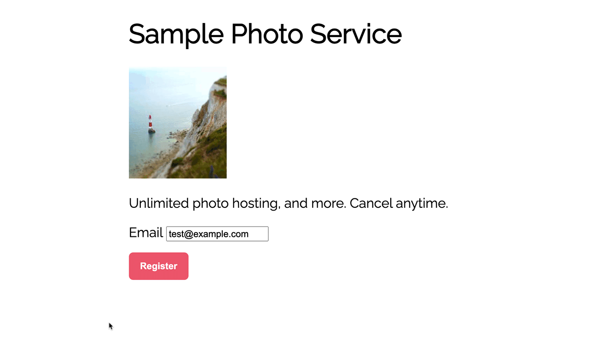

# Subscriptions with fixed price

Create a subscription for an online service with fixed-price options, and work with Stripe Elements to host a payment form on your servers.
This sample shows how to create a customer, set up a card for recurring use, and subscribe them to a subscription plan with
[Stripe Billing](https://stripe.com/billing).

**Demo**



Read more about test cards on Stripe at https://stripe.com/docs/testing.

### Features:

- 💳Securely collect card details
- 🔒Save the payment method details to a customer
- 🚫Handle payment failures
- 💰Subscribe the customer to a subscription plan
- ➕Upgrade and downgrade on prices

## How to run locally

This sample includes [7 server implementations](server/) in our most popular languages. Follow the steps below to run one of the servers locally. This example also includes VanillaJS (no view frameworks) and a React example implementation. Follow the instructions below to get them running.

**1. Clone and configure the sample**

The Stripe CLI is the fastest way to clone and configure a sample to run locally.

**Using the Stripe CLI**

If you haven't already installed the CLI, follow the [installation steps](https://github.com/stripe/stripe-cli#installation) in the project README. The CLI is useful for cloning samples and locally testing webhooks and Stripe integrations.

In your terminal shell, run the Stripe CLI command to clone the sample:

```
stripe samples create subscription-use-cases
```

The CLI will walk you through picking your integration type, server and client languages, and configuring your `.env` config file with your Stripe API keys.

**Installing and cloning manually**

If you do not want to use the Stripe CLI, you can manually clone and configure the sample:

```
git clone git@github.com:stripe-samples/subscription-use-cases.git
```

Copy the `.env.example` file into a file named `.env` in the folder of the server you want to use. For example:

```
cp .env.example server/node/.env
```

You will need a Stripe account in order to run the demo. Once you set up your account, go to the Stripe [developer dashboard](https://stripe.com/docs/development/quickstart#api-keys) to find your API keys.

```
STRIPE_PUBLISHABLE_KEY=<replace-with-your-publishable-key>
STRIPE_SECRET_KEY=<replace-with-your-secret-key>
```

`STATIC_DIR` tells the server where the client files are located and does not need to be modified unless you move the server files.

**[Optional] Run react frontend client**

Copy the `.env.example` file into a file named `.env` in the folder of the server you want to use. For example:

```
cp .env.example client/react/.env
```

You will need to take the Stripe publishable key and set only one variable for the React server.

```
REACT_APP_STRIPE_PUBLISHABLE_KEY=pk_12345
```

**2. Create Products and Prices on Stripe**

This sample requires [Prices](https://stripe.com/docs/api/prices) with
`lookup_key`s of `sample_basic` and `sample_premium` to render the pricing page
and create the Subscription. Products and Prices are objects on Stripe that you
use to model a subscription.

### With Stripe CLI Fixtures

Use the `seed.json` fixture file:

```sh
stripe fixtures seed.json
```

### With Stripe CLI API calls

Or run the following commands and copy the resulting IDs.

```sh
stripe prices create --unit-amount 500 --currency usd -d "recurring[interval]=month" -d "product_data[name]=basic" --lookup-key sample_basic
```

```sh
stripe prices create --unit-amount 900 --currency usd -d "recurring[interval]=month" -d "product_data[name]=premium" --lookup-key sample_premium
```

### With cURL

Replace `sk_test_xxx` with your secret API key:

```sh
curl https://api.stripe.com/v1/prices \
  -u sk_test_xxx: \
  -d "unit_amount"=500 \
  -d "currency"=usd \
  -d "recurring[interval]"=month \
  -d "product_data[name]"=basic \
  -d "lookup_key"=sample_basic \
```

```sh
curl https://api.stripe.com/v1/prices \
  -u sk_test_xxx: \
  -d "unit_amount"=900 \
  -d "currency"=usd \
  -d "recurring[interval]"=month \
  -d "product_data[name]"=premium \
  -d "lookup_key"=sample_premium \
```

**3. Follow the server instructions on how to run:**

Pick the server language you want and follow the instructions in the server folder README on how to run.

```
cd server/node # there's a README in this folder with instructions
npm install
npm start
```

** To run the React client & the node server**

```
cd server/node # there's a README in this folder with instructions
npm install
npm start
```

**4. [Optional] Run a webhook locally:**

You can use the Stripe CLI to forward webhook events to your server running locally.

If you haven't already, [install the CLI](https://stripe.com/docs/stripe-cli) and [link your Stripe account](https://stripe.com/docs/stripe-cli#link-account).

```
stripe listen --forward-to localhost:4242/webhook
```

The CLI will print a webhook secret key to the console. Set `STRIPE_WEBHOOK_SECRET` to this value in your .env file.

You should see events logged in the console where the CLI is running.

When you are ready to create a live webhook endpoint, follow our guide in the docs on [configuring a webhook endpoint in the dashboard](https://stripe.com/docs/webhooks/setup#configure-webhook-settings).

## FAQ

Q: Why did you pick these frameworks?

A: We chose the most minimal framework to convey the key Stripe calls and concepts you need to understand. These demos are meant as an educational tool that helps you roadmap how to integrate Stripe within your own system independent of the framework.

## Get support
If you found a bug or want to suggest a new [feature/use case/sample], please [file an issue](../../../issues).

If you have questions, comments, or need help with code, we're here to help:
- on [Discord](https://stripe.com/go/developer-chat)
- on Twitter at [@StripeDev](https://twitter.com/StripeDev)
- on Stack Overflow at the [stripe-payments](https://stackoverflow.com/tags/stripe-payments/info) tag
- by [email](mailto:support+github@stripe.com)

## Author(s)

- [@ctrudeau-stripe](https://twitter.com/trudeaucj)
- [@suz-stripe](https://twitter.com/noopkat)
