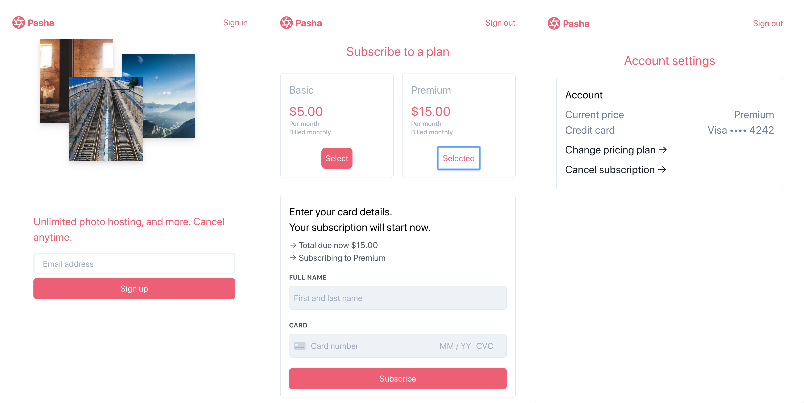

# Subscriptions using React

This sample shows how to build a custom subscriptions form to take a payment using the [Subscriptions API](https://stripe.com/docs/billing/subscriptions/fixed-price), [Stripe Elements](https://stripe.com/billing/elements) and [React](https://reactjs.org/).



## Features

This sample consists of a `client` in React and a `server` piece available in 7 common languages.

The client is implemented using `create-react-app` to provide the boilerplate for React. Stripe Elements is integrated using [`react-stripe-js`](https://github.com/stripe/react-stripe-js), which is the official React library provided by Stripe.

The server includes [7 server implementations](server/README.md) in Node, Ruby, Python, Java, PHP, GO, and dotnet in the [/server](/server) directory. We included several RESTful server implementations, each with the same endpoints and logic.

## How to run locally

To run this sample locally you need to start both a local dev server for the `front-end` and another server for the `back-end`.

You will need a Stripe account with its own set of [API keys](https://stripe.com/docs/development#api-keys).

Follow the steps below to run locally.

**1. Clone and configure the sample**

The Stripe CLI is the fastest way to clone and configure a sample to run locally.

**Using the Stripe CLI**

If you haven't already installed the CLI, follow the [installation steps](https://github.com/stripe/stripe-cli#installation) in the project README. The CLI is useful for cloning samples and locally testing webhooks and Stripe integrations.

In your terminal shell, run the Stripe CLI command to clone the sample:

```
stripe samples create subscription-use-cases
```

The CLI will walk you through picking your integration type, server and client languages, and configuring your .env config file with your Stripe API keys.

**Installing and cloning manually**

If you do not want to use the Stripe CLI, you can manually clone and configure the sample yourself:

```
git clone https://github.com/stripe-samples/react-elements-card-payment
```

Copy the .env.example file into a file named .env in the folder of the server you want to use. For example:

```
cp .env.example server/node/.env
```

You will need a Stripe account in order to run the demo. Once you set up your account, go to the Stripe [developer dashboard](https://stripe.com/docs/development#api-keys) to find your API keys.

```
STRIPE_PUBLISHABLE_KEY=<replace-with-your-publishable-key>
STRIPE_SECRET_KEY=<replace-with-your-secret-key>
```

**Run react frontend client**

Copy the `.env.example` file into a file named `.env` in the folder of the server you want to use. For example:

```
cp .env.example client/react/.env
```

You will need to take the Stripe publishable key and set only one variable for the React server.

```
REACT_APP_STRIPE_PUBLISHABLE_KEY=pk_12345
```

### Running the API server

1. Go to `/server`
1. Pick the language you are most comfortable in and follow the instructions in the directory on how to run.

### Running the React client

1. Go to `/client`
1. Run `npm run install`
1. Run `npm run start` and your default browser should now open with the front-end being served from `http://localhost:3000/`.

### Using the sample app

When running both servers, you are now ready to use the app running in [http://localhost:3000](http://localhost:3000).

1. Enter your email address
1. Select your plan price
1. Enter your card details
1. 🎉

## FAQ

Q: Why did you pick these frameworks?

A: We chose the most minimal framework to convey the key Stripe calls and concepts you need to understand. These demos are meant as an educational tool that helps you roadmap how to integrate Stripe within your own system independent of the framework.

Q: Can you show me how to build X?

A: We are always looking for new recipe ideas, please email dev-samples@stripe.com with your suggestion!

## Author(s)

[@ctrudeau-stripe](https://twitter.com/trudeaucj)
