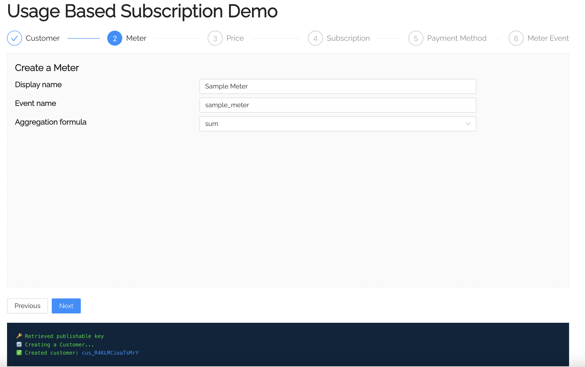

# Subscriptions with metered usage

This sample shows how to

- 👤 Create a customer
- 📏 Create a meter
- 🏷️ Create a price with metered usage option
- 💰 Create a subscription
- 💳 Collect a payment method using Stripe Elements
- 📄 Report usage through v2 endpoint

Read more about usage-based billing at https://docs.stripe.com/billing/subscriptions/usage-based/implementation-guide



### Pre-requisite:

Stripe v2 endpoint requires a [Sandbox](https://docs.stripe.com/sandboxes) secret key. Please create a sandbox account and use a Sandbox API key in this project.

## How to run locally

This sample includes [5 server implementations](server/) in our most popular languages. Follow the steps below to run one of the servers locally.

**1. Clone the project**

```
git clone git@github.com:stripe-samples/subscription-use-cases.git
```

Change into this directory to start configuring the sample:

```
cd subscription-uses-cases/usage-based-subscriptions
```

Copy the `.env.example` file into a file named `.env` in the folder of the server you want to use. For example:

```
cp .env.example server/node/.env
```

You will need a Stripe sandbox account in order to run the demo. Once you set up your account, go to the Stripe [developer dashboard](https://docs.stripe.com/sandboxes/dashboard/manage-access#manage-api-keys) to find your API keys.

```
STRIPE_PUBLISHABLE_KEY=<replace-with-your-sandbox-publishable-key>
STRIPE_SECRET_KEY=<replace-with-your-sandbox-secret-key>
```

**2. Run the server app**

Pick the server language you want and follow the instructions in the server folder README on how to run.

```
cd server/node # there's a README in this folder with instructions
npm install
npm start
```

**3. Run the react client app**

```
cd client/react
npm install
npm start
```

**4. [Optional] Run a webhook locally:**

You can use the Stripe CLI to forward webhook events to your server running locally.

If you haven't already, [install the CLI](https://stripe.com/docs/stripe-cli) and [link your Stripe account](https://stripe.com/docs/stripe-cli#link-account).

```
stripe listen --forward-to localhost:4242/webhook
```

The CLI will print a webhook secret key to the console. Set `STRIPE_WEBHOOK_SECRET` to this value in your .env file.

You should see events logged in the console where the CLI is running.

When you are ready to create a live webhook endpoint, follow our guide in the docs on [configuring a webhook endpoint in the dashboard](https://stripe.com/docs/webhooks/setup#configure-webhook-settings).
